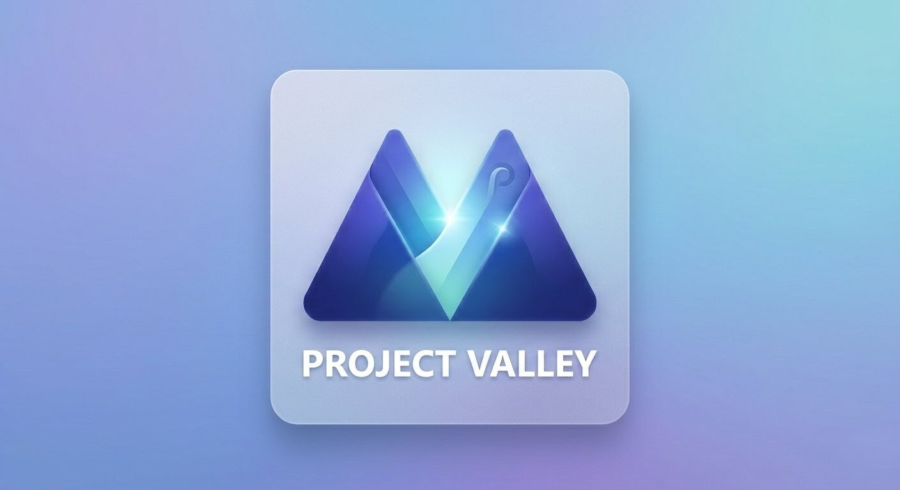

# Project Valley ⛰️

<p align="center">
  
</p>

<p align="center">
  <b>A modern, native dock and top panel for Windows 11, built with WinUI 3.</b>
</p>

---

## 📖 About The Project

Project Valley is an open-source Desktop Environment (DE) enhancement for Windows 11. Inspired by the "Next Valley" design concepts, it replaces the traditional Windows taskbar with a modular, floating dock and a sleek top panel. 

Unlike other docks that rely on custom blur engines or try to mimic macOS, Project Valley is designed to feel 100% native to Windows. It is built from the ground up using **WinUI 3** and leverages native materials like **Acrylic** and **Mica** for a seamless Fluent Design experience.

## ✨ Features (Current & Planned)

- **Native Fluent Design:** Uses official WinUI 3 controls, animations, and materials (Acrylic/Mica).
- **Taskbar Replacement:** Safely hides the default `explorer.exe` taskbar.
- **Top Panel:** A clean status bar at the top of your screen for the system tray, clock, and media controls. *(Work in Progress)*
- **Floating Dock:** A dynamic, centralized dock at the bottom for pinned and running applications. *(Work in Progress)*
- **Smart Window Management:** Automatically adjusts the Windows 'Work Area' so maximized windows don't overlap with the dock or panel.

## 🛠️ Built With

* [WinUI 3 (Windows App SDK)](https://learn.microsoft.com/en-us/windows/apps/winui/winui3/)
* [C# / .NET 10](https://dotnet.microsoft.com/)
* Win32 API (P/Invoke for shell manipulation)

## 🚀 Getting Started

### Prerequisites
* Windows 11
* Visual Studio 2022 (with "Windows application development" workload installed & .NET 10.0 SDK preview)

### Installation & Build
1. Clone the repository:
   ```sh
   git clone https://github.com/Jani-Aelterman/project-valley.git
   ```

    Open the solution .sln in Visual Studio 2022.

    Build and deploy the project (x64).

🛣️ Roadmap

    [x] Basic WinUI 3 transparent window setup without borders

    [x] Win32 hooks to hide default Windows taskbar

    [x] Top Panel UI design & layout (System Tray, Clock, Native Material)

    [ ] Dynamic floating dock (Pill-shape) UI

    [ ] Fetching running app icons and pinning support

    [x] System Tray integration (Win32 CmdPal pattern)

🤝 Contributing

Contributions, issues, and feature requests are highly welcome! Since this project touches deep Win32 APIs and WinUI 3 limits, any help from fellow Windows developers is appreciated.
📝 License

Distributed under the MIT License. See LICENSE for more information.